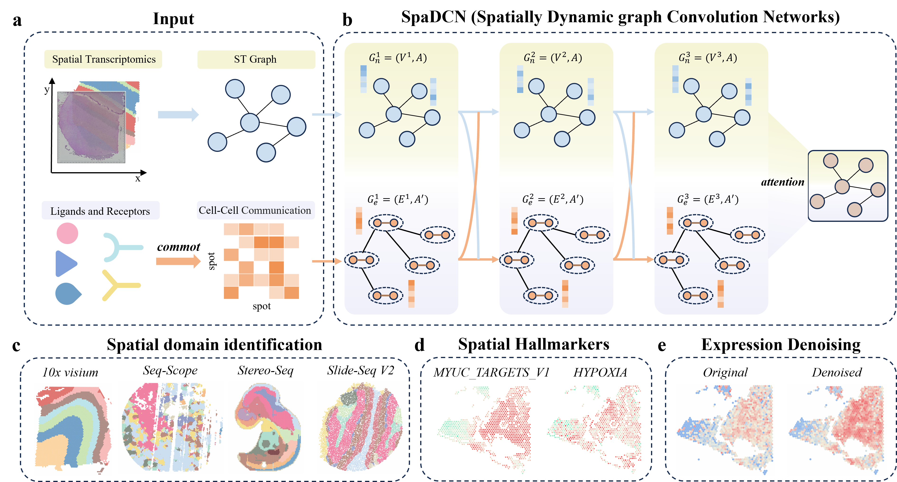

# SpaDCN

SpaDCN(**Spa**tially **D**ynamic graph **C**onvolutional **N**etwork) is a python tool for spatial transcriptomics analysis.

# Abstract

Spatially resolved transcriptomics (SRT) has emerged as a transformative technology for investigating cellular organization and tissue architecture. However, the challenge of identifying pathology-relevant spatial functional landscapes within the tissue microenvironment persists due to the omission of cell-cell communication dynamics. To address this issue, we propose SpaDCN, a **Spa**tially **D**ynamic graph **C**onvolutional **N**etwork architecture, which aligns cell-cell communications and gene expression within spatial context to reveal the spatial functional regions with coherent cellular organization. To effectively transfer the influence of cell-cell communications on expression variation, SpaDCN respectively generates node layer and edge layer of spatial graph representation from expression data and the ligand–receptor complex contributions, and then employs a dynamic graph convolution to switch the propagation of node graph and edge graph. We demonstrate that SpaDCN outperforms existing methods in identifying spatial domains and denoising expression across diverse platforms and species. Notably, SpaDCN excels in identifying marker genes with significant prognostic potential in cancer tissues. In conclusion, SpaDCN offers a powerful and precise tool for spatial domain detection in spatial transcriptomics, with broad applicability across various tissue types and research disciplines.

# Getting started

see [Documentation and Tutorials](https://spadcn-tutorial.readthedocs.io/en/latest/index.html).

# Software dependencies

The dependencies for the codes are listed in requirements.txt

python==3.8

anndata==0.9.2

scanpy==1.9.8

numpy==1.22.0

pandas==2.0.3

scikit-learn==1.3.2

rpy2==3.5.15

torch==2.0.1